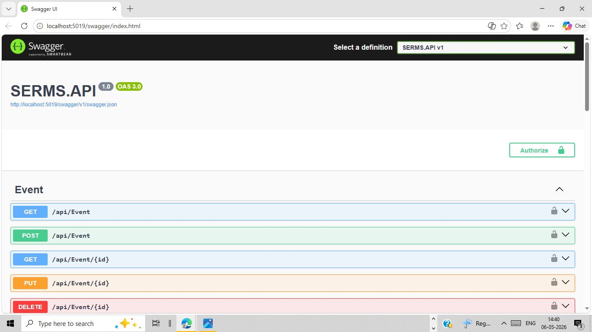
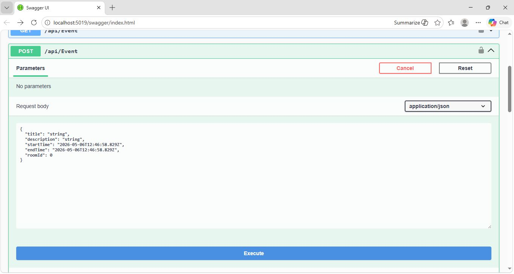
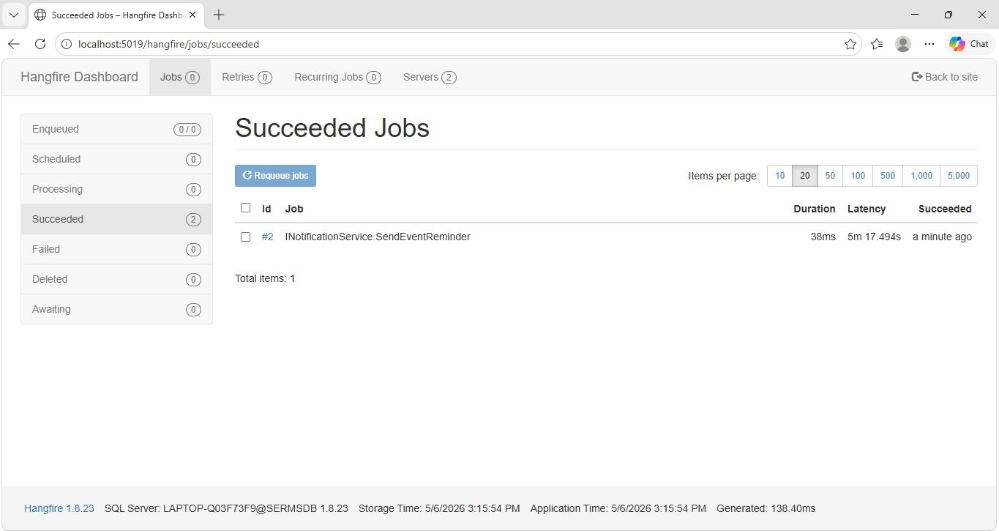
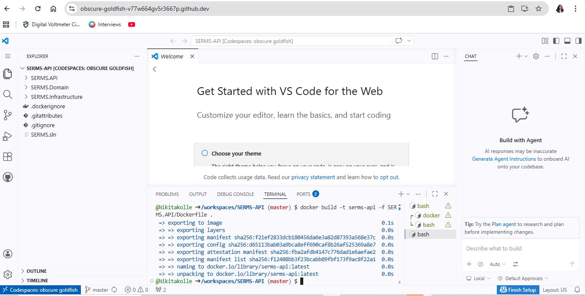

# SERMS - Smart Event & Room Management System

SERMS is a multi-layer ASP.NET Core Web API application designed for event scheduling, room management, participant handling, and automated reminder processing.

The project follows clean architecture principles and demonstrates enterprise-focused backend development practices including JWT authentication, centralized logging, background job scheduling, middleware-based exception handling, and Docker containerization.

---

## Features

- Event Management
- Room Booking Management
- Participant Registration
- JWT Authentication & Authorization
- Background Reminder Jobs using Hangfire
- Global Exception Handling Middleware
- Request Logging with Serilog
- RESTful API Architecture
- Dockerized Application
- Cloud-based Container Execution using GitHub Codespaces

---

## Tech Stack

### Backend
- ASP.NET Core Web API (.NET 8)
- C#
- Entity Framework Core
- SQL Server

### Authentication & Security
- JWT Authentication

### Background Jobs
- Hangfire

### Logging
- Serilog

### DevOps & Deployment
- Docker
- GitHub
- GitHub Codespaces
- GitHub Actions (CI/CD - In Progress)

---

## Engineering Concepts Applied

- Layered Architecture
- Repository Pattern
- Dependency Injection
- Middleware-Based Exception Handling
- JWT-Based Authentication
- Background Job Scheduling
- Containerization with Docker
- RESTful API Design

---

## Project Architecture

```plaintext
SERMS.API             → API Layer / Controllers
SERMS.Domain          → Entities & Interfaces
SERMS.Infrastructure  → Database & Repository Layer
```

The application follows a layered architecture with clear separation of concerns for maintainability, scalability, and clean code organization.

---

## Docker Implementation

The application was containerized using Docker with a multi-stage Dockerfile.

The application was built and executed inside Docker containers to ensure consistent deployment across environments.

### Build Docker Image

```bash
docker build -t serms-api -f SERMS.API/Dockerfile .
```

### Run Docker Container

```bash
docker run -p 5000:80 -e ASPNETCORE_URLS=http://+:80 serms-api
```

---

## API Documentation

Swagger UI is available after running the application:

```plaintext
http://localhost:5000/swagger/index.html
```

---

## Logging

Centralized request and error logging are implemented using Serilog.

Example:
- HTTP Request Logging
- Error Logging
- Middleware Logging

---

## Background Job Processing

Hangfire is used for background task scheduling such as automated event reminders.

Dashboard:
```plaintext
/hangfire
```

---

## Key Learnings

- Multi-layer .NET application architecture
- JWT-based authentication and authorization
- Docker containerization and cloud-based execution
- Background job scheduling with Hangfire
- Middleware and centralized logging implementation
- RESTful API development using ASP.NET Core

---

## Screenshots

### Swagger API Documentation


### Extended Swagger Request Example


### Hangfire Background Job Dashboard


### Docker Image Build


---

## Future Improvements

- CI/CD Pipeline using GitHub Actions
- Azure Deployment
- Frontend Integration with React
- Role-Based Authorization
- Email Notification Service

---

## Author

Nikita kolle
